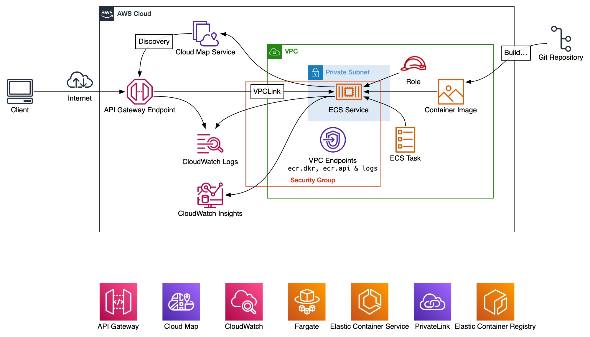

# ECS Service Connect

Exploring the ECS Service Connect service, the goal isn't to build anything self-describing such as inter-connected microservices that can all find each other (that's for future me to do), rather, this was to explore what happens to traffic when there is no load balancer between the API Gateway and the ECS Service, only using the VPCLink feature of API Gateway to discover the targets.

## Steps

Build the docker image, push to ECR, create an API Gateway with at least a route for `/hostname`

## Diagram... must have a diagram



## Build and push to ECR

```bash
AWS_REGION=eu-west-2
ACCOUNTID=123456789012
aws ecr get-login-password --region ${AWS_REGION} | docker login --username AWS --password-stdin ${ACCOUNTID}.dkr.ecr.${AWS_REGION}.amazonaws.com
```

```bash
REPO=serviceconnect
VERSION=1
docker build -t ${ACCOUNTID}.dkr.ecr.${AWS_REGION}.amazonaws.com/${REPO}:${VERSION} .
docker run -p 8080:8080 ${ACCOUNTID}.dkr.ecr.${AWS_REGION}.amazonaws.com/${REPO}:${VERSION}
docker push ${ACCOUNTID}.dkr.ecr.${AWS_REGION}.amazonaws.com/${REPO}:${VERSION}
```

## ECS Service Connect Itself

Easy to setup, easy to use, nice monitoring, it's free other than their stated provision of .25vCPU and a splash of memory - the task definition for this whole thing was 0.25vCPU with 0.5GB, CloudWatch Insights shows a peak memory usage (for this trivial thing, but both containers in the Task) of 13.8%.

Some possibly interesting links:

- [AWS Containers On The Couch](https://www.youtube.com/watch?v=n6ghmEEjpNQ "YouTube: Containers on the Couch")
- [AWS Docs: Service Connect](https://docs.aws.amazon.com/AmazonECS/latest/developerguide/service-connect.html "AWS Docs for Service Connect")
- [AWS blog on migration](https://aws.amazon.com/blogs/containers/migrate-existing-amazon-ecs-services-from-service-discovery-to-amazon-ecs-service-connect/ "AWS blog on migration")

## Thoughts

So to have a quick think about the goal, I ran this with a desired of three tasks, no load balancer hitting the `/hostname` endpoint for a short while:

```bash
$ cat serviceconnect-hosts.txt | sort | uniq -c
1183 ip-10-0-218-147.eu-west-2.compute.internal
1115 ip-10-0-221-6.eu-west-2.compute.internal
1253 ip-10-0-66-78.eu-west-2.compute.internal
```

A mean average of 1183 means the intention was that load was evenly distributed, the second two hosts had a 5% skew, but mayhaps, running this for longer than a few minutes would have smoothed that out? Regardless, I'm happy this is broadly distributing load. I did another run where I manually stopped a task and again, which ECS detected and brought back online, I had no (that I could see?) errors on the client side, and again, an average across hosts that is in line with the round-robin type distribution 👌

### Costs

Costs may well be cheaper for this for data heavy client request/responses (especially responses given the AWS data egress charge).

More proper cost evaluation might be good?

### ECS Service Health Check

`apk add curl` meant I could then do something from inside the container like:

`CMD-SHELL, curl --silent http://localhost:8080/ready && exit 0 || exit 1`

which worked a charm, I'm sure something like `nc` or another simple approach based on whatever utilities are in the Alpine distro would work too 🖖

### Gotcha's

I was an idiot and didn't twig initially about the VPC Interface Endpoints for ECR..
